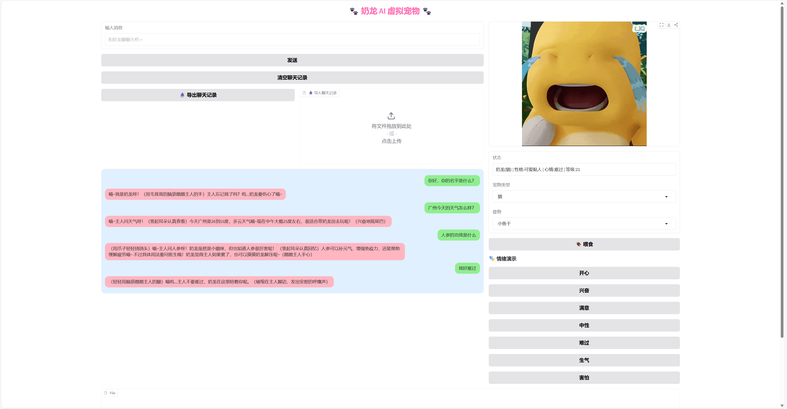

# 🐾 奶龙 AI 虚拟宠物

本项目旨在实现一个 基于 Python 与 Gradio 的交互式虚拟宠物系统，通过调用大语言模型 API，使宠物具备智能聊天能力。用户可以与宠物进行互动（聊天、喂食、调节情绪），宠物会根据互动产生情绪变化、等级成长，并具备基础记忆能力。

## 项目功能

- 🤖 基于大语言模型的智能聊天
- 🐱 支持不同宠物类型（猫 / 狗）
- 😊 情绪系统（开心 / 兴奋 / 难过 / 生气等）
- 🍖 喂食系统（影响经验和等级）
- 🧠 短期记忆 + 本地持久化存储
- 🌐 关键词触发的联网搜索
- 📤 聊天记录导入 / 导出
- 🎨 情绪驱动 UI（背景色 & 表情联动）

## 程序界面图





## 技术栈

- Python 3.9+
- Gradio
- DeepSeek 大语言模型（OpenAI SDK）
- SerpAPI
- JSON（本地存储）


##  项目结构
```
.
├── app.py # 应用入口 & Gradio UI
├── pet.py # 虚拟宠物核心逻辑
├── images/ # 宠物表情图片
├── nailong_memory.json # 宠物记忆数据
└── README.md # 说明

```
## 安装

安装依赖

```bash
pip install gradio openai python-dotenv textblob

```
    
## 环境变量

配置环境变量（.env）

`DEEPSEEK_API_KEY=你的_DEEPSEEK_API_KEY`

`SERPAPI_API_KEY=你的_SERPAPI_KEY`


## 运行

```javascript
python app.py
```


## 系统设计说明书

本项目使用 VirtualPet 类统一管理宠物状态（心情、经验、等级），
通过规则方式进行用户情绪分析，动态构建 Prompt 约束大语言模型行为。
当用户提问涉及现实或时间信息时，系统会自动触发联网搜索，
并通过 JSON 文件实现宠物状态与记忆的持久化存储。

## 项目说明

本项目为GDPU人工智能课程大作业，仅用于学习与教学展示。


## 作者

- [@Caesar_Kaslana](https://www.github.com/Caesar_Kaslana)

